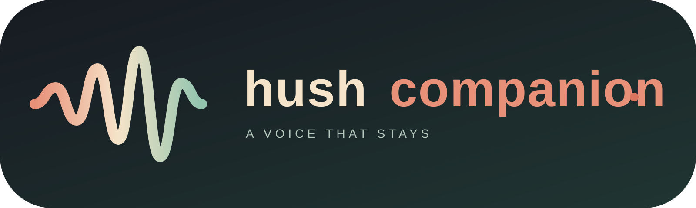

# Hush Companion

<p align="center">
  
</p>

Hush Companion is a local-first voice companion with four conversation modes:

- **Vent** — talk freely and receive supportive reflections.
- **Debate** — test an idea, prepare for a difficult conversation, or practice an argument.
- **Listen** — choose a topic and let Hush Companion provide a spoken overview.
- **Wellness check-in** — reflect, ground yourself, or choose one healthy next step.

The web app uses React and Vite. You can use Google Gemini with a key supplied by each user, or use Ollama locally. Kokoro provides optional local text-to-speech.

> **Project status:** Hush Companion is an experimental prototype, not a production medical, mental-health, or emergency service. AI responses may be inaccurate or unsuitable. See the in-app AI disclaimer before using the project.

## Why Hush Companion exists

Hush Companion was created to give people a small, calm space to speak without needing to type, perform, or organize their thoughts first. Many people need to talk through a difficult moment, examine a decision, or learn about a topic, but do not always have a person available at that exact time.

The project focuses on:

- **Voice-first interaction** for people who think better by speaking.
- **Local-first privacy** so self-hosters can keep conversations close to their own devices.
- **User choice** through both local Ollama and bring-your-own-key Google Gemini support.
- **Clear boundaries** that make it explicit that Hush Companion is AI, not a therapist or emergency service.
- **Open development** so developers can inspect, improve, and adapt the experience.

Hush Companion is not intended to replace human relationships or professional care. It is a tool for reflection, practice, curiosity, and making a little room to breathe.

## Marketing and positioning

Hush Companion can be presented as:

> **A private voice companion for thinking out loud.**

Short product description:

> Talk it out, think it through, or simply listen. Hush Companion gives you a calm, voice-first space for reflection and everyday ideas—with local AI support or your own Google Gemini key.

### How Hush Companion supports people

Hush Companion gives people a calm place to start when their thoughts feel difficult to organize or say out loud. It supports people by:

- Letting them speak freely instead of requiring long written messages
- Reflecting what they share so they can hear their thoughts more clearly
- Helping them break a confusing situation into smaller parts
- Providing a safe way to practice difficult conversations or arguments
- Offering topic explanations in the Listen mode for learning and curiosity
- Guiding short, non-clinical grounding, breathing, journaling, and workday reset exercises
- Encouraging one practical next step rather than overwhelming them with advice
- Giving users control through local Ollama or their own Gemini key

Hush Companion is designed to support reflection and everyday wellbeing—not to replace trusted people, qualified professionals, therapy, or emergency services.

### Who it is for

- People who prefer speaking over typing
- Developers who want a self-hosted voice AI starter project
- Students practicing presentations or difficult conversations
- Curious users exploring local and bring-your-own-key AI
- Teams experimenting with private voice interfaces

### What makes it different

- No account or login required
- No subscription or payment wall in the open-source version
- Bring your own Gemini key, or run Ollama locally
- Optional local Kokoro text-to-speech
- Conversations and transcript downloads remain browser-local unless sent to the selected AI provider
- Open-source MIT license for customization and self-hosting

### Example launch message

> Meet Hush Companion—a voice-first AI companion for the moments when you need to get thoughts out of your head. Vent, debate, or listen in a calm interface that supports Google Gemini with your own key or fully local Ollama models. No account required. Open source and privacy-conscious by design.

Marketing claims should remain accurate: do not describe Hush Companion or Wellness check-in as therapy, crisis support, medical care, a human companion, or a guarantee that data never leaves the device when a cloud AI provider is selected.

## Features

- Responsive web interface with light and dark themes
- Browser speech recognition and speech synthesis fallbacks
- Optional local Kokoro TTS voices
- Streaming Google Gemini or Ollama responses with an offline fallback
- Vent, Debate, Listen, and Wellness check-in modes
- Conversation summaries and local transcript downloads
- No account, login, or payment provider required
- Optional local Fastify API proxy for Ollama and Kokoro
- Expo starter app in [`apps/mobile`](apps/mobile)
- Unit tests for core helpers and AI client behavior

## Repository layout

```text
src/                 React web app and shared client helpers
tests/               Vitest test suite
api-server/          Optional Fastify proxy for local Ollama and Kokoro
voice-server/        FastAPI local Kokoro TTS service
apps/mobile/         Expo mobile starter
cloudflared/         Example tunnel configuration
```

## Documentation

- [Project documentation](docs/README.md)
- [Hush Companion avatar](docs/hush-avatar.svg) · [horizontal logo](docs/hush-companion-logo.svg)
- [Google Gemini API documentation](https://ai.google.dev/gemini-api/docs)
- [Gemini API key and Google AI Studio](https://aistudio.google.com/app/apikey)
- [Gemini text generation guide](https://ai.google.dev/gemini-api/docs/text-generation)
- [Gemini API reference](https://ai.google.dev/api)
- [Ollama documentation](https://docs.ollama.com/)
- [Kokoro on Hugging Face](https://huggingface.co/hexgrad/Kokoro-82M)
- [Vite guide](https://vite.dev/guide/)
- [React documentation](https://react.dev/)
- [Expo documentation](https://docs.expo.dev/)
- [Cloudflare Tunnel documentation](https://developers.cloudflare.com/cloudflare-one/connections/connect-networks/)
- [Contributing guide](#contributing)
- [Contact and support](#contact-and-support)
- [Monetization roadmap](docs/monetization.md)
- [Corporate wellness direction](docs/corporate-wellness.md)
- [Corporate outreach guide](docs/corporate-outreach.md)
- [License](LICENSE)

## Requirements

- Node.js 20 or newer
- npm
- Python 3.12 for the optional Kokoro service
- A modern browser with microphone support for voice input
- [Ollama](https://ollama.com/) only if you choose the local Ollama provider

## Quick start

Install the web dependencies and start Vite:

```bash
npm install
npm run dev
```

Open the local Vite URL shown in the terminal. Without a configured AI provider, Hush Companion uses a local fallback response so the interface can still be explored.

## Configure AI providers

Open **AI settings** in the Hush Companion header and choose a provider.

### Google Gemini

Yes, users can use their own Google AI API key instead of Ollama:

1. Create a key in [Google AI Studio](https://aistudio.google.com/app/apikey).
2. Start Hush Companion and open **AI settings**.
3. Select **Google Gemini**.
4. Paste the key and save it.

The key is stored only in that browser's `localStorage` and is sent directly to Google's Gemini API. Hush Companion does not upload, export, or store the key on its server. This is convenient for a personal or self-hosted app, but a browser-based API key cannot be treated as a server secret: browser extensions, local malware, shared computers, and browser developer tools may expose it. Restrict the key in Google Cloud/AI Studio, monitor usage, and revoke it if exposed.

The default model is `gemini-2.5-flash`. To change the default for a deployment, set:

```bash
VITE_GEMINI_MODEL=gemini-2.5-flash
```

### Ollama

Choose **Ollama** in AI settings and use the default local URL and model, or configure:

```bash
VITE_API_URL=http://localhost:11434
VITE_OLLAMA_MODEL=gemma3:4b
```

Hush Companion uses Ollama's local API and does not require an API key.

## Configure the web app

Copy the example environment file if you want deployment defaults:

```bash
cp .env.example .env.local
```

Available variables:

| Variable | Purpose |
| --- | --- |
| `VITE_GEMINI_MODEL` | Default Gemini model shown to users. |
| `VITE_OLLAMA_MODEL` | Default Ollama model. |
| `VITE_API_URL` | Ollama URL, or the optional local proxy URL. |
| `VITE_TTS_URL` | Optional Kokoro/API proxy URL for voice output; leave unset to use browser speech. |

Do not commit `.env.local` or API keys. User-entered Gemini keys are intentionally kept out of environment files and are saved only in the browser.

## Run local Kokoro text-to-speech

Create a Python 3.12 virtual environment and install the voice server dependencies:

```bash
python3.12 -m venv .venv-kokoro
source .venv-kokoro/bin/activate
pip install -r voice-server/requirements.txt
python -m uvicorn voice-server.tts_server:app --host 127.0.0.1 --port 8000
```

The service exposes `http://localhost:8000/tts` and includes built-in Kokoro voices. To enable it in the web app, set `VITE_TTS_URL=http://localhost:8000`; if `VITE_TTS_URL` is unset, the browser uses speech synthesis without making a request to port 8000.

## Optional local API proxy

The proxy forwards local Ollama and Kokoro requests and applies CORS and rate limiting. It has no login or payment integration. It is intended for local/self-hosted use; add authentication before exposing it to untrusted users.

```bash
cd api-server
npm install
cp .env.example .env
npm run dev
```

Then set this in the web app's `.env.local` when using the proxy for Ollama:

```bash
VITE_API_URL=http://localhost:3000
```

The proxy expects Ollama at `http://127.0.0.1:11434` and Kokoro at `http://127.0.0.1:8000` by default. Override them with `OLLAMA_URL` and `KOKORO_URL` in `api-server/.env` if needed. Gemini requests do not use this proxy; the user's key is sent directly from the browser to Google.

## Mobile starter

The Expo starter lives in `apps/mobile`:

```bash
cd apps/mobile
npm install
npx expo start
```

For a physical device, configure the app to use the machine's LAN IP or a public HTTPS API URL. Do not use `localhost` or `127.0.0.1` from a phone. Native microphone and audio features require an Expo development build and the relevant Xcode or Android Studio setup.

## Cloudflare Tunnel

`cloudflared/config.yml.example` contains a sample configuration for routing a public hostname to the API proxy. Because the proxy currently has no authentication, do not expose it publicly without adding an authentication layer, access controls, and rate limits first.

## Development

From the repository root:

```bash
npm run typecheck
npm test
npm run build
```

The project uses Vitest for tests and Vite for the web production build.

## Privacy and safety

- Review Google's Gemini API terms and privacy controls before using a user-supplied key.
- Avoid sending passwords, financial information, or other sensitive data to any AI service.
- Restrict and rotate browser-supplied Gemini keys; usage charges and quotas belong to the key owner.
- Do not expose the unauthenticated API proxy to the public internet.
- Do not use Hush Companion for emergencies, diagnosis, treatment, or other high-risk decisions.

## Contributing

Issues and pull requests are welcome. Please keep changes focused, add or update tests for behavior changes, and never commit API keys, local environment files, virtual environments, dependency folders, or generated artifacts.

## Corporate wellness direction

The Wellness check-in mode is a non-clinical starting point for everyday reflection, grounding, workday resets, and healthy next steps. A future corporate edition could add private workspaces, hosted AI and voice, privacy-preserving aggregate reports, retention controls, custom branding, and priority support. See the [corporate wellness direction](docs/corporate-wellness.md) before making enterprise claims.

## Monetization roadmap

The GitHub version remains free and open source. Optional revenue can come from developer support, setup help, private self-hosted deployments, custom development, and GitHub Sponsors. See the [monetization roadmap](docs/monetization.md) for the current GitHub-only approach.

## Contact and support

For questions, feedback, deployment requests, or partnership ideas, email [hello.hushcompanion@gmail.com](mailto:hello.hushcompanion@gmail.com) or contact [devkdas on GitHub](https://github.com/devkdas).

Hush Companion is maintained by **devkdas**. If this project is useful to you, please consider supporting its continued development:

[](https://github.com/sponsors/devkdas)

Your support helps fund maintenance, documentation, accessibility improvements, and new AI and voice features.

## License

Hush Companion is released under the [MIT License](LICENSE).
